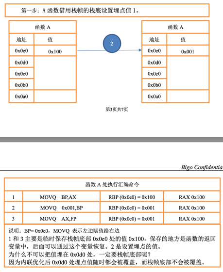
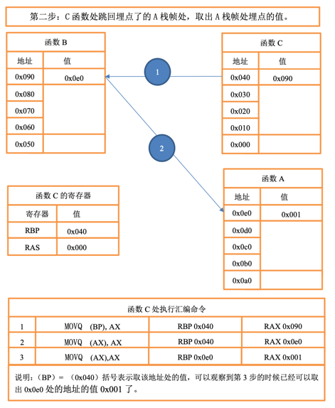
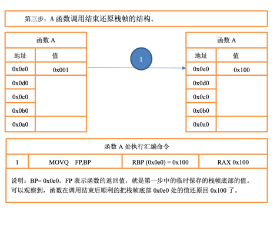

# go_-argument_stack

### 1.平台要求x86
### 2.例子如下：  
```go
package main

import "fmt"

func main() {
	A()
}

func A()  {
	a := SetRbp(10) // 设置A栈帧的 Rbp 寄存器的值为 10
	B()
	BackRbp(a)         // 恢复A栈帧的 Rbp 地址
}
func B()  {
	C()
	v := GetBackRbp(1)  // 往上跳一个栈帧的首部， 取出埋入的值 10
	fmt.Println(v)
}
func C()  {
	v := GetBackRbp(2) // 往上跳一个两个栈帧的首部， 取出埋入的值 10
	fmt.Println(v)
}

```
### 3.原理说明

基于栈帧埋点的隐式传参技术原理分三部分操作:  
第一步:A 函数借用栈帧的栈底设置埋点值。  
第二步:C 函数处跳回埋点了的 A 栈帧处，取出 A 栈帧处埋点的值。   
第三步:A 函数调用结束还原栈帧的结构。  





### 4.调试说明

```
go build -gcflags "-N -l" .   //禁止编译器优化，因为优化的汇编几乎不可读
```
```
gdb -tui go_-argument_stack                 //用tui更加方便汇编调试
```
```

layout asm   //显示汇编

b main.main  //在主函数断点

next         // 单补执行

ni           // 单独执行一条汇编

step         // 进入函数

info registers //显示寄存器

```


